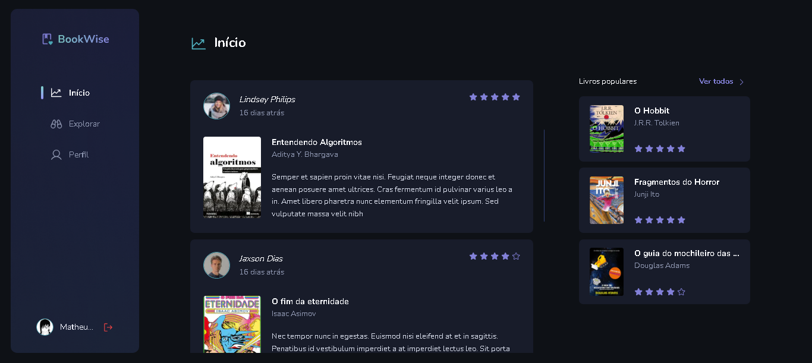

<a name="readme-top"></a>

<!-- PROJECT LOGO -->
<br />
<div align="center">

  <a href="https://github.com/DarkMetaK/bookwise">
    
  </a>

  <h3 align="center">Bookwise</h3>

  <p align="center">
    Plataforma de review de livros, com sistema de autenticação OAuth
  </p>
</div>


<!-- TABLE OF CONTENTS -->
<details>
  <summary>Sumário</summary>
  <ol>
    <li>
      <a href="#sobre">Sobre</a>
      <ul>
        <li><a href="#tecnologias">Tecnologias</a></li>
      </ul>
    </li>
    <li>
      <a href="#como-rodar-o-projeto">Como rodar o projeto</a>
    </li>
    <li><a href="#contato">Contato</a></li>
    <li><a href="#agradecimentos">Agradecimentos</a></li>
  </ol>
</details>


<!-- ABOUT THE PROJECT -->
## Sobre

<a href="darkmetak-bookwise.vercel.app/">
    
</a>

O projeto é um website para compartilhamento de reviews de livros, sendo possível realizar login por meio de plataformas como Google e Github. Toda sua estrutura foi desenvolvida com Next.js utilizando App Router, como forma de solidificar o conhecimento no framework e em outras tecnologias como Prisma. Além de postar reviews, o usuário consegue visualizar outros perfis e explorar o católogo de livros por meio de filtros.

### Tecnologias

[![Next][Next.js]][Next-url]<br>
[![TypeScript][TypeScript.js]][TypeScript-url]<br>
[![Prisma][Prisma]][Prisma-url]<br>

<p align="right">(<a href="#readme-top">Retornar ao topo</a>)</p>

<!-- GETTING STARTED -->
## Como rodar o projeto

É possível acessar a plataforma acessando o link: https://darkmetak-timer.netlify.app/

1 - Clone o repositório
```sh
git clone https://github.com/DarkMetaK/bookwise.git
```

2 - Configure as variáveis de ambiente
```sh
# NEXT
NEXTAUTH_SECRET='SOME_SECRET'
NEXTAUTH_URL=http://localhost:3000

# GOOGLE OAUTH
GOOGLE_CLIENT_ID='GOOGLE_APP_CLIENT_ID'
GOOGLE_CLIENT_SECRET='GOOGLE_APP_CLIENT_SECRET'

# GITHUB OAUTH
GITHUB_CLIENT_ID='GITHUB_APP_CLIENT_ID'
GITHUB_CLIENT_SECRET='GITHUB_APP_CLIENT_SECRET'

# PRISMA
DATABASE_URL='./dev.db'
```

3 - Inicialize e popule o prisma
```sh
npx prisma migrate dev --name init
```
```sh
npx prisma db seed
```

4 - Rode o projeto
```sh
npm run dev
```

<p align="right">(<a href="#readme-top">Retornar ao topo</a>)</p>

<!-- CONTACT -->
## Contato

Matheus Porto - [LinkedIn](https://www.linkedin.com/in/matheusport0/) - matporto03@gmail.com

Link Repositório: [https://github.com/DarkMetaK/bookwise](https://github.com/DarkMetaK/bookwise)

<p align="right">(<a href="#readme-top">Retornar ao topo</a>)</p>

<!-- ACKNOWLEDGMENTS -->
## Agradecimentos

* [Best-README-Template](https://github.com/othneildrew/Best-README-Template)
* [Img Shields](https://shields.io)
* [Next Auth](https://next-auth.js.org/)

<p align="right">(<a href="#readme-top">Retornar ao topo</a>)</p>

<!-- MARKDOWN LINKS & IMAGES -->
[Next.js]: https://img.shields.io/badge/next.js-000000?style=for-the-badge&logo=nextdotjs&logoColor=white
[Next-url]: https://nextjs.org/
[TypeScript.js]: https://shields.io/badge/TypeScript-3178C6?logo=TypeScript&logoColor=FFF&style=for-the-badge
[TypeScript-url]: https://www.typescriptlang.org/
[Prisma]: https://img.shields.io/badge/Prisma-3982CE?style=for-the-badge&logo=Prisma&logoColor=white
[Prisma-url]: https://www.prisma.io/
